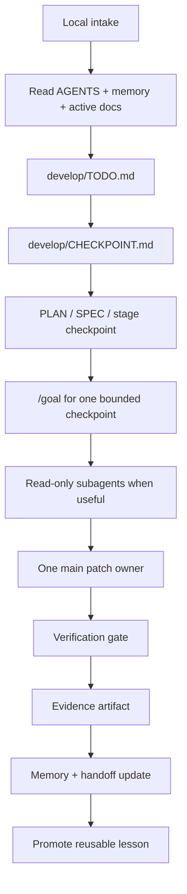

# Source of Truth

Personal AI Engineering playbook and starter kit for agent-assisted projects.

This repository is the canon for how my projects are started, continued, verified, handed off, and improved. It keeps the working method outside chat history and makes every project feel like the same system: one flow, one vocabulary, one evidence trail.

The workflow is local-first. GitHub is the readable front door for the repository, not the required task tracker. Daily work lives in local files under `develop/`, not GitHub Issues.

## What This Is

`source_of_truth` has two jobs:

| Layer | Purpose | Main paths |
| --- | --- | --- |
| Public site | Blog, playbook pages, research notes and reusable prompts | `content/`, `layouts/`, `static/` |
| Starter kit | Project-local agent rules, memory, stages, evidence, templates and hooks | `templates/project-starter/`, `AGENTS.md`, `playbooks/`, `rules/`, `memory/` |

It is not a product repo. Product-specific truth belongs in the product repository. This repo holds the reusable operating system.

## The Flow

Every project should run through the same spine:



Short version:

```text
intake -> TODO -> CHECKPOINT -> goal -> patch -> checks -> evidence -> memory -> lesson
```

## Quick Start

Install and check this repository:

```powershell
npm install
npm run check
```

Start the public site locally:

```powershell
npm run dev
# http://localhost:1313/
```

Bootstrap a new project with the operating skeleton:

```powershell
powershell -ExecutionPolicy Bypass -File scripts\bootstrap_project.ps1 -TargetPath D:\WORK\new-project
```

Then fill these first:

1. `memory/MEMORY.md`
2. `develop/IMPLEMENTATION_PLAN.md`
3. `develop/LOCAL_RUNBOOK.md`
4. `develop/TODO.md`
5. `develop/CHECKPOINT.md`
6. first checkpoint spec under `develop/stages/`
7. project-specific notes in `AGENTS.md`

## Start Here

For humans:

- [AGENTS.md](AGENTS.md) - canonical operating guide.
- [playbooks/project-operating-flow.md](playbooks/project-operating-flow.md) - the main checkpoint workflow.
- [templates/project-starter/README.md](templates/project-starter/README.md) - what lands in a new project.
- [docs/DECISIONS.md](docs/DECISIONS.md) - durable decisions about this repo.

For agents:

- Read [AGENTS.md](AGENTS.md) first.
- Read [memory/MEMORY.md](memory/MEMORY.md) and [memory/SESSION-HANDOFF.md](memory/SESSION-HANDOFF.md).
- Choose the matching playbook from [playbooks/](playbooks/).
- Keep project state in files, not chat.
- For non-trivial work, write or update a checkpoint spec before implementation.

## Repository Map

```text
source_of_truth/
  AGENTS.md                         canonical operating guide
  README.md                         GitHub entry point
  docs/DECISIONS.md                 durable repo decisions
  memory/                           live memory plus reusable templates
  playbooks/                        repeatable workflows
  rules/                            reusable agent/process rules
  hooks/                            hook prompt templates and future enforcement points
  agents/                           reusable specialist agent profiles
  templates/project-starter/        skeleton copied into new projects
  content/                          Hugo public site content
  layouts/                          Hugo layouts
  scripts/bootstrap_project.ps1     starter installer
  work/                             volatile local artifacts
  archive/                          closed or demoted material
```

## Starter Kit Output

A bootstrapped project gets this operating layer:

```text
project/
  AGENTS.md
  CLAUDE.md
  .cursor/rules/project-canon.mdc
  .claude/rules/project-checklist.md
  memory/MEMORY.md
  memory/SESSION-HANDOFF.md
  docs/DECISIONS.md
  develop/README.md
  develop/IMPLEMENTATION_PLAN.md
  develop/LOCAL_RUNBOOK.md
  develop/TODO.md
  develop/CHECKPOINT.md
  develop/stages/
  develop/artifacts/
  develop/decisions/
  work/
  archive/
```

This gives each project the same shape:

- `AGENTS.md` says how work is run.
- `memory/` says what is true now.
- `develop/stages/` says what checkpoint to execute.
- `develop/artifacts/` proves what happened.
- `.cursor/` and `.claude/` stay thin wrappers around the same canon.
- GitHub Issues are optional and not part of the default workflow.

## Task Routing

| Input | First output | Gate |
| --- | --- | --- |
| Product idea | lightweight PRD or SPEC | no implementation until scope is clear |
| Feature | checkpoint spec | scope, anti-scope, checks, stop condition |
| Bug | expected-vs-actual and regression barrier | fix plus proof |
| Research link or repo | research note | pattern extraction before rule changes |
| Tool adoption | capability plan | rollback and access boundary |
| Public article | draft under `content/` | no private project data |

## Local Task Queue

The default queue is file-based:

| File | Purpose |
| --- | --- |
| `develop/TODO.md` | local backlog and next tasks |
| `develop/CHECKPOINT.md` | one active bounded slice |
| `develop/IMPLEMENTATION_PLAN.md` | stage map and current status |
| `memory/SESSION-HANDOFF.md` | latest resume context |

Use GitHub Issues only when explicitly needed for public collaboration. Local work does not depend on them.

## Agent Roles

One main agent owns final edits. Subagents are read-only unless a checkpoint explicitly grants a narrow disjoint write scope.

| Role | Purpose |
| --- | --- |
| `explorer` | affected files, local patterns, blast radius |
| `reviewer` | scope drift, correctness, security/privacy risks |
| `test-auditor` | missing or weak acceptance coverage |
| `docs-researcher` | official docs and version-sensitive facts |
| `browser-debug` | UI repro, screenshots, traces and visual evidence |
| `worker` | narrow implementation slice, only when explicitly assigned |

## Evidence Contract

A checkpoint is not done because the agent says it is done. It is done when evidence exists.

Evidence should record:

- inputs read;
- scope and anti-scope;
- changed files or behavior;
- verification commands and results;
- screenshots, traces or logs when relevant;
- reviewer and test-auditor notes;
- known gaps;
- next step;
- status: `DONE`, `DONE_WITH_CONCERNS`, `BLOCKED`, or `NEEDS_CONTEXT`.

Reference: [content/playbook/evidence-contract.md](content/playbook/evidence-contract.md).

## Public Site

The Hugo site publishes reusable material:

| Section | Purpose |
| --- | --- |
| `content/blog/` | personal lessons and public essays |
| `content/playbook/` | stable operating rules |
| `content/research/` | reference scans and tool/repo analysis |
| `content/prompts/` | reusable prompts |

Build:

```powershell
npm run build
```

## Research Policy

New links start as research, not rules.

```text
link -> research note -> extracted pattern -> playbook update -> optional blog post
```

Recent reference scan:

- [content/research/agent-workflow-reference-scan.md](content/research/agent-workflow-reference-scan.md)

## Design Principles

- Keep one canon and many thin wrappers.
- Push context into files, not chat history.
- Prefer reusable workflows over long prompts.
- Turn repeated fixes into rules, templates, hooks or skills.
- Separate stable canon from volatile work artifacts.
- Treat research as reference, not automatic requirement.

## Maintenance Checklist

Before closing meaningful work in this repo:

```powershell
npm run check
git diff --check
```

Update memory when project state changes:

- [memory/MEMORY.md](memory/MEMORY.md)
- [memory/SESSION-HANDOFF.md](memory/SESSION-HANDOFF.md)
