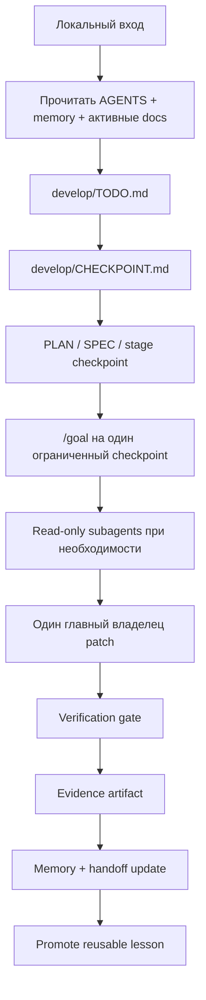

# Source of Truth

Личный AI Engineering playbook, starter kit и Codex onboarding pack для проектов с агентами.

Это репозиторий-канон: как мои проекты стартуют, продолжаются, проверяются, передаются между сессиями и улучшаются. Смысл простой: не держать процесс в чате, а сделать так, чтобы каждый проект ощущался одинаково: один flow, один словарь, один след доказательств.

Workflow здесь local-first. GitHub нужен как понятная витрина репозитория, а не как обязательный таск-трекер. Ежедневная работа живет в локальных файлах под `develop/`, а не в GitHub Issues.

Личный Codex stack тоже часть канона. Глобальные правила должны быть короткими, live skill registry остается источником правды по skills, `SKILL.md` читается по требованию, а MCP держится маленьким allow-list: Lazyweb для product UI, Context7 для актуальных docs, browser/runtime tools для проверки.

## Что Это

У `source_of_truth` три роли:

| Слой | Назначение | Основные пути |
| --- | --- | --- |
| Публичный сайт | Блог, playbook-страницы, research notes и reusable prompts | `content/`, `layouts/`, `static/` |
| Executable onboarding pack | Skill-driven подготовка сырого проекта к разработке | `skills/source-of-truth-onboarding/`, `scripts/install_codex_skill.ps1`, `scripts/audit_project_readiness.ps1` |
| Starter kit | Project-local правила агентов, память, stages, evidence, templates и hooks | `templates/project-starter/`, `AGENTS.md`, `playbooks/`, `rules/`, `memory/` |
| Personal Codex stack | Личный operating layer для Codex: стиль, skills, MCP, cleanup и no overcoding | `registries/`, `content/playbook/personal-codex-stack.md`, `docs/DECISIONS.md` |

Это не продуктовый репозиторий. Правда конкретного продукта должна жить в его репозитории. Здесь лежит переиспользуемая операционная система работы.

## Flow

Каждый проект идет по одному позвоночнику:



Коротко:

```text
intake -> TODO -> CHECKPOINT -> goal -> patch -> checks -> evidence -> memory -> lesson
```

Для больших multi-surface задач этот flow расширяется до orchestrator checkpoint workflow:

```text
orchestrator -> inventory -> checkpoint registry -> small batches -> bounded subagents -> durable summaries -> synthesis stage
```

Использовать его, когда задача покрывает много ролей, вкладок, экранов, модулей или states, а один монолитный `/goal` рискует потерять контекст. Подробный playbook: [playbooks/orchestrator-checkpoint-workflow.md](playbooks/orchestrator-checkpoint-workflow.md).

## Быстрый Старт

Установить зависимости и проверить репозиторий:

```powershell
npm install
npm run check
```

Проверить capability и readiness gates:

```powershell
npm run audit:capabilities
npm run audit:readiness
```

Запустить публичный сайт локально:

```powershell
npm run dev
# http://localhost:1313/
```

Развернуть operating skeleton в новом проекте:

```powershell
powershell -ExecutionPolicy Bypass -File scripts\bootstrap_project.ps1 -TargetPath D:\WORK\new-project
```

Потом первым делом заполнить:

1. `memory/MEMORY.md`
2. `docs/PRODUCT_DIRECTION.md`
3. `docs/ARCHITECTURE.md`
4. `docs/SKILLS.md`
5. `memory/QUESTIONS.md` и `memory/LESSONS.md`
6. `develop/IMPLEMENTATION_PLAN.md`
7. `develop/LOCAL_RUNBOOK.md`
8. `develop/TODO.md`
9. `develop/CHECKPOINT.md`
10. первый checkpoint spec под `develop/stages/`
11. project-specific заметки в `AGENTS.md`

## С Чего Начинать

Для человека:

- [AGENTS.md](AGENTS.md) - главный operating guide.
- [content/playbook/personal-codex-stack.md](content/playbook/personal-codex-stack.md) - как держать личный Codex быстрым, точным и без мусорного контекста.
- [playbooks/project-operating-flow.md](playbooks/project-operating-flow.md) - основной checkpoint workflow.
- [playbooks/orchestrator-checkpoint-workflow.md](playbooks/orchestrator-checkpoint-workflow.md) - workflow для больших задач через orchestrator, registry и bounded subagents.
- [registries/capabilities.md](registries/capabilities.md) - required/recommended skills, MCP и plugins для нормального Codex operating flow.
- [registries/capability-sources.md](registries/capability-sources.md) - откуда брать skills, MCP и plugins и когда installation запрещена.
- [skills/source-of-truth-onboarding/SKILL.md](skills/source-of-truth-onboarding/SKILL.md) - onboarding skill, который готовит проект до implementation.
- [templates/project-starter/README.md](templates/project-starter/README.md) - что попадает в новый проект.
- [docs/DECISIONS.md](docs/DECISIONS.md) - durable decisions по этому репозиторию.

Для агента:

- Сначала прочитать [AGENTS.md](AGENTS.md).
- Потом [memory/MEMORY.md](memory/MEMORY.md) и [memory/SESSION-HANDOFF.md](memory/SESSION-HANDOFF.md).
- Выбрать подходящий playbook из [playbooks/](playbooks/).
- Если задача зависит от skills, MCP, plugins или global Codex setup, проверить [registries/capabilities.json](registries/capabilities.json) и запустить read-only audit.
- Держать состояние проекта в файлах, не в чате.
- Для нетривиальной работы сначала написать или обновить checkpoint spec.

## Карта Репозитория

```text
source_of_truth/
  AGENTS.md                         главный operating guide
  README.md                         входная страница для GitHub
  docs/                             product direction, architecture, skills, decisions
  develop/                          execution layer для самого source_of_truth
  skills/source-of-truth-onboarding/ repo-owned onboarding skill
  memory/                           живая память и шаблоны памяти
  registries/                       required/recommended capabilities и Codex global contour
  playbooks/                        повторяемые workflow
  rules/                            reusable agent/process rules
  hooks/                            hook prompt templates и будущие enforcement points
  agents/                           reusable specialist agent profiles
  templates/project-starter/        skeleton для новых проектов
  content/                          контент Hugo-сайта
  layouts/                          Hugo layouts
  scripts/bootstrap_project.ps1     установщик starter kit
  scripts/install_codex_skill.ps1   safe install/update repo-owned skills
  scripts/audit_project_readiness.ps1 readiness gate для target projects
  work/                             volatile local artifacts
  archive/                          закрытые или демотированные материалы
```

## Что Получает Новый Проект

После bootstrap в проекте появляется operating layer:

```text
project/
  AGENTS.md
  CLAUDE.md
  .cursor/rules/project-canon.mdc
  .claude/rules/project-checklist.md
  docs/PRODUCT_DIRECTION.md
  docs/ARCHITECTURE.md
  docs/SKILLS.md
  docs/DECISIONS.md
  memory/MEMORY.md
  memory/SESSION-HANDOFF.md
  memory/QUESTIONS.md
  memory/LESSONS.md
  rules/
  hooks/
  agents/README.md
  develop/README.md
  develop/IMPLEMENTATION_PLAN.md
  develop/LOCAL_RUNBOOK.md
  develop/TODO.md
  develop/CHECKPOINT.md
  develop/stages/
  develop/artifacts/
  develop/decisions/
  work/
  archive/
```

Это дает каждому проекту один и тот же силуэт:

- `AGENTS.md` говорит, как ведется работа.
- `docs/` говорит, что строится, какие boundaries и какие skills нужны.
- `memory/` говорит, что сейчас правда.
- `rules/`, `hooks/` и `agents/` задают project-local operating contract.
- `develop/TODO.md` держит локальную очередь.
- `develop/CHECKPOINT.md` держит активный срез.
- `develop/stages/` описывает, что выполнять.
- `develop/artifacts/` доказывает, что произошло.
- `.cursor/` и `.claude/` остаются тонкими wrappers вокруг того же canon.
- GitHub Issues опциональны и не входят в default workflow.

## Роутинг Задач

| Вход | Первый выход | Gate |
| --- | --- | --- |
| Идея продукта | lightweight PRD или SPEC | не начинать implementation, пока scope не ясен |
| Feature | checkpoint spec | scope, anti-scope, checks, stop condition |
| Bug | expected-vs-actual и regression barrier | fix плюс proof |
| Research link или repo | research note | pattern extraction перед rule changes |
| Tool adoption | capability plan плюс проверка personal Codex stack | rollback и access boundary |
| Публичная статья | draft под `content/` | без private project data |

## Локальная Очередь

Default queue - файловая:

| Файл | Назначение |
| --- | --- |
| `develop/TODO.md` | локальный backlog и следующие задачи |
| `develop/CHECKPOINT.md` | один активный ограниченный срез |
| `develop/IMPLEMENTATION_PLAN.md` | карта stages и текущий статус |
| `memory/SESSION-HANDOFF.md` | последний resume context |

GitHub Issues использовать только когда явно нужна публичная совместная работа. Локальный flow от них не зависит.

## Роли Агентов

Один главный агент владеет итоговыми правками. Subagents read-only, если checkpoint явно не выдал narrow disjoint write scope.

Для больших задач текущий основной чат становится `orchestrator`: он держит scope, Browser/session state, checkpoint registry, durable summaries и финальный synthesis. Subagents получают только bounded checkpoint, а не весь проектный контекст.

| Роль | Зачем нужна |
| --- | --- |
| `explorer` | affected files, local patterns, blast radius |
| `reviewer` | scope drift, correctness, security/privacy risks |
| `test-auditor` | missing or weak acceptance coverage |
| `docs-researcher` | official docs и version-sensitive facts |
| `browser-debug` | UI repro, screenshots, traces и visual evidence |
| `worker` | узкий implementation slice, только если явно назначен |

## Evidence Contract

Checkpoint не готов, потому что агент сказал “готово”. Он готов, когда есть evidence.

Evidence фиксирует:

- какие inputs прочитаны;
- scope и anti-scope;
- какие файлы или поведение изменились;
- verification commands и results;
- screenshots, traces или logs, если уместно;
- reviewer и test-auditor notes;
- known gaps;
- next step;
- status: `DONE`, `DONE_WITH_CONCERNS`, `BLOCKED`, `NEEDS_CONTEXT`.

Ссылка: [content/playbook/evidence-contract.md](content/playbook/evidence-contract.md).

## Публичный Сайт

Hugo-сайт публикует reusable material:

| Раздел | Назначение |
| --- | --- |
| `content/blog/` | личные уроки и публичные статьи |
| `content/playbook/` | стабильные operating rules |
| `content/research/` | reference scans и tool/repo analysis |
| `content/prompts/` | reusable prompts |

Сборка:

```powershell
npm run build
```

## Research Policy

Новая ссылка сначала research, а не rule.

```text
link -> research note -> extracted pattern -> playbook update -> optional blog post
```

Свежий reference scan:

- [content/research/agent-workflow-reference-scan.md](content/research/agent-workflow-reference-scan.md)

## Capability Registry

Внешние skills, MCP и plugins фиксируются не в глобальном `AGENTS.md`, а в registry:

```text
registries/capabilities.json
registries/capabilities.md
registries/capability-sources.md
registries/codex-global.json
```

`capabilities.json` обязан содержать `sources[]` для каждой capability. Если source неизвестен, агент не ставит MCP/skill/plugin через guessed clone или shell snippet, а пишет `BLOCKED`/`DEGRADED` и сначала чинит registry.

Для plugins config не считается установкой. Нужна cache-проверка:

```text
~/.codex/plugins/cache/<marketplace>/<plugin>/<version>/.codex-plugin/plugin.json
```

Проверить текущий Codex setup:

```powershell
npm run audit:capabilities
```

Прямой запуск:

```powershell
powershell -ExecutionPolicy Bypass -File scripts\audit_codex_capabilities.ps1
```

Global Codex edits идут только через:

```text
audit -> proposed diff -> explicit approval -> backup -> scoped write -> verify -> evidence
```

Фраза разрешения на запись в `~/.codex`:

```text
разрешаю обновить глобалку Codex
```

Safe what-if для установки repo-owned onboarding skill:

```powershell
npm run install:onboarding-skill:whatif
```

Реальная установка в `~/.codex` разрешена только после явного approval и должна идти через backup/evidence.

## Принципы

- Один canon, много тонких wrappers.
- Контекст в файлах, не в chat history.
- Reusable workflow лучше длинного prompt.
- Повторяемые fixes превращаются в rules, templates, hooks или skills.
- Required capabilities проверяются registry-аудитом, а не длинной ручной картой в глобалке.
- Stable canon отдельно от volatile work artifacts.
- Research - reference, не automatic requirement.

## Maintenance Checklist

Перед закрытием значимой работы в этом repo:

```powershell
npm run check
git diff --check
```

Обновить memory, если состояние проекта изменилось:

- [memory/MEMORY.md](memory/MEMORY.md)
- [memory/SESSION-HANDOFF.md](memory/SESSION-HANDOFF.md)
