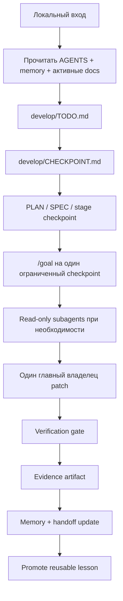

# Source of Truth

Личный AI Engineering playbook и starter kit для проектов с агентами.

Это репозиторий-канон: как мои проекты стартуют, продолжаются, проверяются, передаются между сессиями и улучшаются. Смысл простой: не держать процесс в чате, а сделать так, чтобы каждый проект ощущался одинаково: один flow, один словарь, один след доказательств.

Workflow здесь local-first. GitHub нужен как понятная витрина репозитория, а не как обязательный таск-трекер. Ежедневная работа живет в локальных файлах под `develop/`, а не в GitHub Issues.

## Что Это

У `source_of_truth` две роли:

| Слой | Назначение | Основные пути |
| --- | --- | --- |
| Публичный сайт | Блог, playbook-страницы, research notes и reusable prompts | `content/`, `layouts/`, `static/` |
| Starter kit | Project-local правила агентов, память, stages, evidence, templates и hooks | `templates/project-starter/`, `AGENTS.md`, `playbooks/`, `rules/`, `memory/` |

Это не продуктовый репозиторий. Правда конкретного продукта должна жить в его репозитории. Здесь лежит переиспользуемая операционная система работы.

## Flow

Каждый проект идет по одному позвоночнику:



Коротко:

```text
intake -> TODO -> CHECKPOINT -> goal -> patch -> checks -> evidence -> memory -> lesson
```

## Быстрый Старт

Установить зависимости и проверить репозиторий:

```powershell
npm install
npm run check
```

Запустить публичный сайт локально:

```powershell
npm run dev
# http://localhost:1313/
```

Развернуть operating skeleton в новом проекте:

```powershell
powershell -ExecutionPolicy Bypass -File scripts\bootstrap_project.ps1 -TargetPath D:\WORK\new-project
```

Потом первым делом заполнить:

1. `memory/MEMORY.md`
2. `develop/IMPLEMENTATION_PLAN.md`
3. `develop/LOCAL_RUNBOOK.md`
4. `develop/TODO.md`
5. `develop/CHECKPOINT.md`
6. первый checkpoint spec под `develop/stages/`
7. project-specific заметки в `AGENTS.md`

## С Чего Начинать

Для человека:

- [AGENTS.md](AGENTS.md) - главный operating guide.
- [playbooks/project-operating-flow.md](playbooks/project-operating-flow.md) - основной checkpoint workflow.
- [templates/project-starter/README.md](templates/project-starter/README.md) - что попадает в новый проект.
- [docs/DECISIONS.md](docs/DECISIONS.md) - durable decisions по этому репозиторию.

Для агента:

- Сначала прочитать [AGENTS.md](AGENTS.md).
- Потом [memory/MEMORY.md](memory/MEMORY.md) и [memory/SESSION-HANDOFF.md](memory/SESSION-HANDOFF.md).
- Выбрать подходящий playbook из [playbooks/](playbooks/).
- Держать состояние проекта в файлах, не в чате.
- Для нетривиальной работы сначала написать или обновить checkpoint spec.

## Карта Репозитория

```text
source_of_truth/
  AGENTS.md                         главный operating guide
  README.md                         входная страница для GitHub
  docs/DECISIONS.md                 durable decisions
  memory/                           живая память и шаблоны памяти
  playbooks/                        повторяемые workflow
  rules/                            reusable agent/process rules
  hooks/                            hook prompt templates и будущие enforcement points
  agents/                           reusable specialist agent profiles
  templates/project-starter/        skeleton для новых проектов
  content/                          контент Hugo-сайта
  layouts/                          Hugo layouts
  scripts/bootstrap_project.ps1     установщик starter kit
  work/                             volatile local artifacts
  archive/                          закрытые или демотированные материалы
```

## Что Получает Новый Проект

После bootstrap в проекте появляется operating layer:

```text
project/
  AGENTS.md
  CLAUDE.md
  .cursor/rules/project-canon.mdc
  .claude/rules/project-checklist.md
  memory/MEMORY.md
  memory/SESSION-HANDOFF.md
  docs/DECISIONS.md
  develop/README.md
  develop/IMPLEMENTATION_PLAN.md
  develop/LOCAL_RUNBOOK.md
  develop/TODO.md
  develop/CHECKPOINT.md
  develop/stages/
  develop/artifacts/
  develop/decisions/
  work/
  archive/
```

Это дает каждому проекту один и тот же силуэт:

- `AGENTS.md` говорит, как ведется работа.
- `memory/` говорит, что сейчас правда.
- `develop/TODO.md` держит локальную очередь.
- `develop/CHECKPOINT.md` держит активный срез.
- `develop/stages/` описывает, что выполнять.
- `develop/artifacts/` доказывает, что произошло.
- `.cursor/` и `.claude/` остаются тонкими wrappers вокруг того же canon.
- GitHub Issues опциональны и не входят в default workflow.

## Роутинг Задач

| Вход | Первый выход | Gate |
| --- | --- | --- |
| Идея продукта | lightweight PRD или SPEC | не начинать implementation, пока scope не ясен |
| Feature | checkpoint spec | scope, anti-scope, checks, stop condition |
| Bug | expected-vs-actual и regression barrier | fix плюс proof |
| Research link или repo | research note | pattern extraction перед rule changes |
| Tool adoption | capability plan | rollback и access boundary |
| Публичная статья | draft под `content/` | без private project data |

## Локальная Очередь

Default queue - файловая:

| Файл | Назначение |
| --- | --- |
| `develop/TODO.md` | локальный backlog и следующие задачи |
| `develop/CHECKPOINT.md` | один активный ограниченный срез |
| `develop/IMPLEMENTATION_PLAN.md` | карта stages и текущий статус |
| `memory/SESSION-HANDOFF.md` | последний resume context |

GitHub Issues использовать только когда явно нужна публичная совместная работа. Локальный flow от них не зависит.

## Роли Агентов

Один главный агент владеет итоговыми правками. Subagents read-only, если checkpoint явно не выдал narrow disjoint write scope.

| Роль | Зачем нужна |
| --- | --- |
| `explorer` | affected files, local patterns, blast radius |
| `reviewer` | scope drift, correctness, security/privacy risks |
| `test-auditor` | missing or weak acceptance coverage |
| `docs-researcher` | official docs и version-sensitive facts |
| `browser-debug` | UI repro, screenshots, traces и visual evidence |
| `worker` | узкий implementation slice, только если явно назначен |

## Evidence Contract

Checkpoint не готов, потому что агент сказал “готово”. Он готов, когда есть evidence.

Evidence фиксирует:

- какие inputs прочитаны;
- scope и anti-scope;
- какие файлы или поведение изменились;
- verification commands и results;
- screenshots, traces или logs, если уместно;
- reviewer и test-auditor notes;
- known gaps;
- next step;
- status: `DONE`, `DONE_WITH_CONCERNS`, `BLOCKED`, `NEEDS_CONTEXT`.

Ссылка: [content/playbook/evidence-contract.md](content/playbook/evidence-contract.md).

## Публичный Сайт

Hugo-сайт публикует reusable material:

| Раздел | Назначение |
| --- | --- |
| `content/blog/` | личные уроки и публичные статьи |
| `content/playbook/` | стабильные operating rules |
| `content/research/` | reference scans и tool/repo analysis |
| `content/prompts/` | reusable prompts |

Сборка:

```powershell
npm run build
```

## Research Policy

Новая ссылка сначала research, а не rule.

```text
link -> research note -> extracted pattern -> playbook update -> optional blog post
```

Свежий reference scan:

- [content/research/agent-workflow-reference-scan.md](content/research/agent-workflow-reference-scan.md)

## Принципы

- Один canon, много тонких wrappers.
- Контекст в файлах, не в chat history.
- Reusable workflow лучше длинного prompt.
- Повторяемые fixes превращаются в rules, templates, hooks или skills.
- Stable canon отдельно от volatile work artifacts.
- Research - reference, не automatic requirement.

## Maintenance Checklist

Перед закрытием значимой работы в этом repo:

```powershell
npm run check
git diff --check
```

Обновить memory, если состояние проекта изменилось:

- [memory/MEMORY.md](memory/MEMORY.md)
- [memory/SESSION-HANDOFF.md](memory/SESSION-HANDOFF.md)
